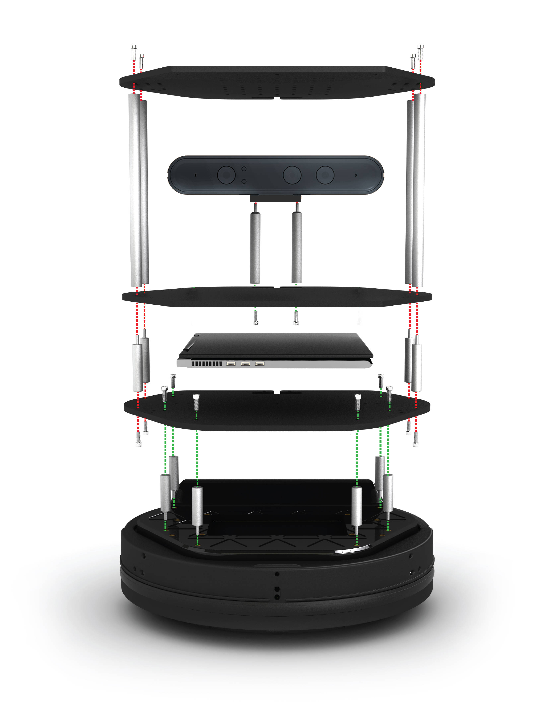

# Turtlebot Setup

## Overview
TurtleBot 2 is an open robotics platform designed for education and research on state of art robotics. It is also a powerful  tool to teach and learn ROS (Robot Operating System) and make the most of this cutting edge techonology. Equipped with a 3D sensor, it can map and navigate indoor enviroments. Due to the Turtlebot's modularity, you can attach your own sensors, electronics, and mechanics easily.

## Physical Assembly:

 

[Return to the main README page](/README.md)
