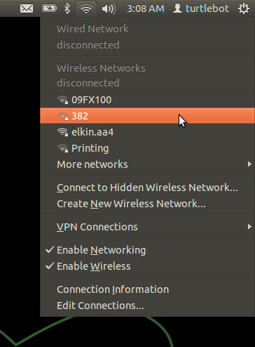
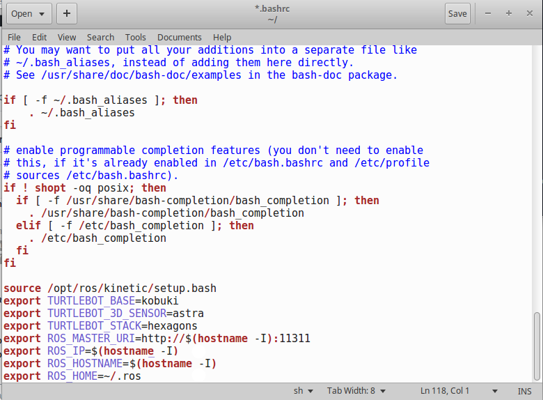

## Network Setup
Connect to a Wireless, Ethernet, or Cellular network using the Network Manager (upper right corner of desktop).



Using the `hostname` command in Linux, we are able to dynamically load the IP of the computer that will be on the Turtlebot so that less configuration is needed.


1. You can find the IP of a computer by opening a terminal and typing:
```bash
hostname -I
```

2. Add the network parameters to your BashRC for the turtlebot computer  
(bashrc is a file that configures the Linux shell environment)  
    1. Open a new terminal on the turtlebot computer and type the following:  
       (Breakdown of commands explained in the next section of this document)
```bash
echo export ROS_MASTER_URI=http://\$\(hostname -I\):11311 >> ~/.bashrc
echo export ROS_IP=\$\(hostname -I\) >> ~/.bashrc
echo export ROS_HOSTNAME=\$\(hostname -I\) >> ~/.bashrc
echo export ROS_HOME=\~/.ros >> ~/.bashrc
```
(The backwards slash `\` is an escape character in a Linux terminal shell)

3. Add the network parameters to your BashRC for the master computer:  
    1. Open a new terminal on the master computer, and type the following:  
       (Replace `IP_OF_TURTLEBOT` with the ip found in step `1`)  
```bash
echo export ROS_MASTER_URI=http://IP_OF_TURTLEBOT:11311 >> ~/.bashrc
echo export ROS_IP=\$\(hostname -I\) >> ~/.bashrc
echo export ROS_HOSTNAME=\$\(hostname -I\) >> ~/.bashrc
echo export ROS_HOME=\~/.ros >> ~/.bashrc
```

4. Verify that the commands have been properly and printed to the bashrc file:
    1. Open a new terminal on both the master computer and the turtlebot computer
      * `gedit ~/.bashrc`
      * Scroll all the way down, and verify that the end of the file looks like this:


4. Load the new environment variables above into your active terminal window  
    1. On both Master and Turtlebot computers, open a terminal and type:
```bash
source ~/.bashrc
```

## Command Breakdown
```bash
echo export ROS_MASTER_URI=http://\$\(hostname -I\):11311 >> ~/.bashrc
```
  `echo` is a Linux command that prints text to a designated output (default is the terminal)  
  `export` is a Linux shell command that handles variables in the shell environment  
  `ROS_MASTER_URI` is the network address for a ROS instance to contact a ROS Master Server  
  `http://\$\(hostname -I\):11311` sets the designated network address using the current IP found by the `hostname` command, and the `\` are escape characters to prevent the hostname command from being run in the terminal  
  `>> ~/.bashrc` tells the `echo` command to send the output to the file ~/.bashrc  

```bash
echo export ROS_IP=\$\(hostname -I\) >> ~/.bashrc
```
  `echo` is a Linux command that prints text to a designated output (default is the terminal)  
 `export` is a Linux shell command that handles variables in the shell environment  
 `ROS_IP` is the network address for a ROS instance to contact a ROS Master Server  
 `\$\(hostname -I\)` sets the designated network address using the current IP found by the `hostname` command, and the `\` are escape characters to prevent the hostname command from being run in the terminal  
 `>> ~/.bashrc` tells the `echo` command to send the output to the file ~/.bashrc  

```bash
echo export ROS_HOSTNAME=\$\(hostname -I\) >> ~/.bashrc
```
 `echo` is a Linux command that prints text to a designated output (default is the terminal)  
 `export` is a Linux shell command that handles variables in the shell environment  
 `ROS_HOSTNAME` is the name of the computer on a network, used for communication on a local network  
 `\$\(hostname -I\)` sets the designated network name using the current hostname found by the `hostname` command, and the `\` are escape characters to prevent the hostname command from being run in the terminal  
 `>> ~/.bashrc` tells the `echo` command to send the output to the file ~/.bashrc  

```bash
echo export ROS_HOME=\~/.ros >> ~/.bashrc
```
 `echo` is a Linux command that prints text to a designated output (default is the terminal)  
 `export` is a Linux shell command that handles variables in the shell environment  
 `ROS_HOME` is the environment variable for the location of the ROS home folder  
 `\~/.ros` is the directory in Linux for the location of the ROS home folder  

## Network Testing
ROS requires completely free network connectivity between the Turtlebot and the Master computer.

1. Test the Ping command between the Master and the Turtlebot:
    1. On the master computer, open a new terminal:
      * `ping IP_OF_TURTLEBOT`
      * You should see the following returned if the Turtlebot is on the network:
```
PING IP_OF_TURTLEBOT (IP_OF_TURTLEBOT) 56(84) bytes of data.
64 bytes from IP_OF_TURTLEBOT: icmp_seq=1 ttl=64 time=66.8 ms
```

2. Try connecting to the ROS Master server hosted on the Turtlebot
    1. On the Turtlebot, open a new terminal and type:
      * `roscore`
    2. On the master computer, open a new terminal and type:
      * `rostopic list`
    3. If successful, you should see the following output:
```
/rosout
/rosout_agg
```

# Troubleshooting
If your laptop cannot connect to the network, ensure that you installed [the proprietary drivers](http://askubuntu.com/questions/22118/can-i-install-extra-drivers-via-the-command-prompt).

If you continue to have issues, check out the [ROS Network Setup Page](http://wiki.ros.org/ROS/NetworkSetup)
 

[Return to the main README page](/README.md)
