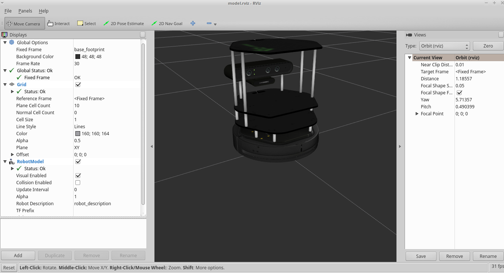
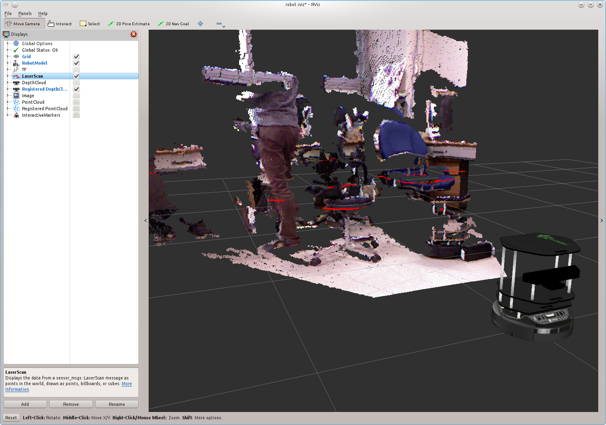
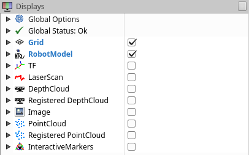

## Turtlebot Visualization
Visualizing the 3D Turtlebot model and the data streaming from the Turtlebot can be done through the ROS Visualization (RVIZ) packages.

RVIZ can be run standalone: `rosrun rviz rviz`

## Viewing the Turtlebot Model
You can preview the Turtlebot Model to verify that the RVIZ and Turtlebot packages are installed.
- In a new terminal: `roslaunch turtlebot_rviz_launchers view_model.launch`

## Viewing the Live Turtlebot Data
You can view live sensor data streamed from the Turtlebot by using RVIZ.
- In a new terminal: `roslaunch turtlebot_rviz_launchers view_robot.launch`

You can view the output of a topic by click on the checkbox to the right of the topic name in the Displays section

You may need to rotate the view in RVIZ around the robot in order to properly view the data output.
 

[Return to the main README page](/README.md)
