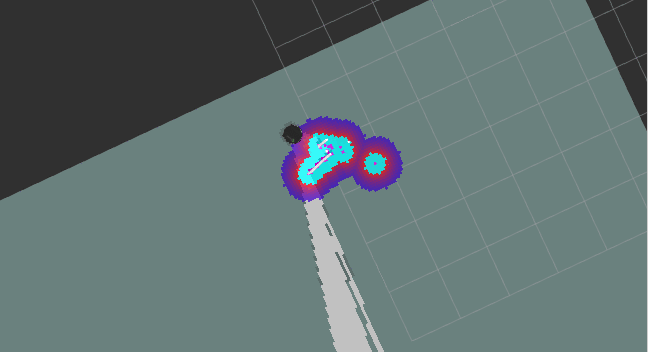
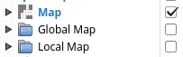
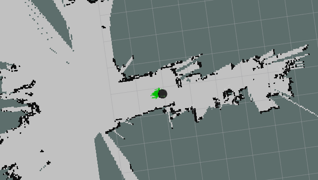
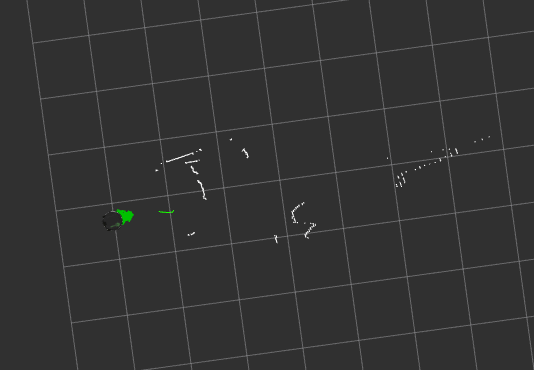
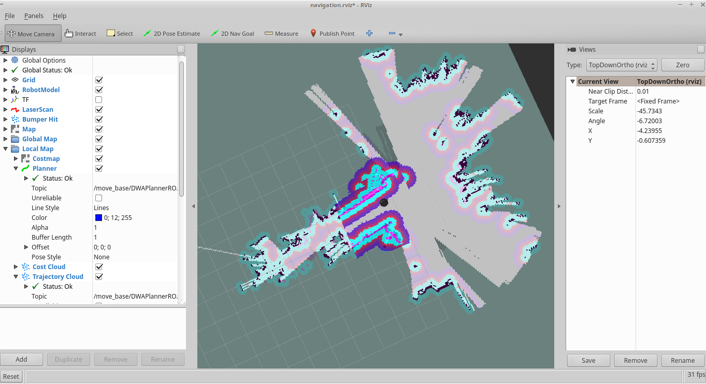
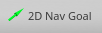

## GMapping
Gmapping is a laser-based SLAM (Simultaneous Localization and Mapping) algorithm that builds a 2d map.  
It uses laser scan data and odometry data from the Turtlebot to feed a highly efficient Rao-Blackwellized particle filer to learn grid maps from laser range data.  

The laser scan is generated by taking the point cloud from the 3D sensor and grabbing points from an "eye-level" prespective of the robot. It does not use any RGB data, or any full depth data.

## Starting Gmapping
1. On Turtlebot, start minimal.launch
    1. `roslaunch turtlebot_bringup minimal.launch`

2. On Turtlebot, start the gmapping_demo.launch
    1. `roslaunch turtlebot_navigation gmapping_demo.launch`
        * the gmapping_demo.launch automatically launches 3dsensor.launch

3. On the master computer, start RVIZ
    1. `roslaunch turtlebot_rviz_launchers view_navigation.launch`

4. On the master computer, start keyboard teleop
    1. `roslaunch turtlebot_teleop keyboard_teleop.launch`

5. Drive the Turtlebot around your map using the keyboard_teleop, and visualize the collected data in RVIZ.
    * In order to collect data fully, you will need to stop the turtlebot periodically and slowly turn the turtlebot in circles  
    

    * The CostMap may be confusing, so you can disable it at first:  
    
    * While you drive the Turtlebot around, it will begin to generate a map  
    
      * The white in the map is known empty space
      * The dark borders around the white are known obstacles such as walls and other objects
      * The grey tiles surrounding the map is unknown space
    * If you disable the map, global map, and local map in the RVIZ Displays, you can view just the laser scan:  
    
      * The white squiggles are a simulated laser scan using the 3D point cloud data from the 3d sensor  
        The laser scan is simulated because the Gmapping algorithm was built to use data from a 2D laser, which enables us to reuse the ROS Navigation stack, which was designed for LiDARs  

6. Save the gmapping map
    1. On the Turtlebot computer, open a new terminal and type:
       * `rosrun map_server map_saver -f ~/gmapping_01`
    2. This creates 2 files
       * `~/gmapping_01.yaml` - a configuration file that specifies where the map image is located, the map resolution, and the start point
       * `~/gmapping_01.pgm` - a grayscale binary image file that represents an image of the scanned map 

7. Once you have saved the map
    1. On the Turtlebot  
       * Close out of the gmapping.launch terminal
    2. On the master computer
       * Close out of the view_navigation.launch terminal

## Navigating a map saved using Gmapping
1. On the Turtlebot, open a new terminal and type:
    1. `export TURTLEBOT_MAP_FILE=~/gmapping_01.yaml` 
    2. `roslaunch turtlebot_navigation amcl_demo.launch`

2. Localize the Turtlebot
    1. On the master computer, open RVIZ
        * `roslaunch turtlebot_rviz_launchers view_navigation.launch`
        * In RVIZ, you will see the Turtlebot with a bunch of green arrows which are hypothesis of the position of the Turtlebot
    2. Select the "2D Pose Estimate" button on the top bar and draw the location that the Turtlebot is most near
        * 
    3. On the Master Computer, open a new terminal and type:
        * `roslaunch turtlebot_teleop keyboard_teleop.launch`
    4. Drive the Turtlebot around slowly in a circle until the green arrows are closer to the Turtlebot  
    

3. Send a navigation goal to the Turtlebot
    1. Close out of all `teleop` terminals
    2. Select the "2D Nav Goal" button on the top bar and draw the location that you want the Turtlebot to travel to 
        * 

## GMapping Uses
Gmapping is great for real-time environment recognition where there are a lot of objects present.
The more physical data available around the Turtlebot, the better the map will be.

Gmapping is meant to provide a map for navigation planning without overloading the computer.
It may have issues with small objects, or big solid-colored surfaces such as white walls.
 

[Return to the main README page](/README.md)
