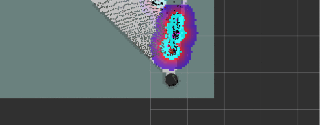
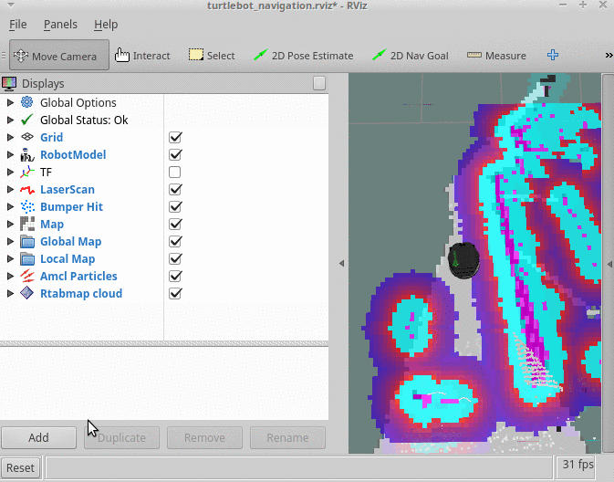
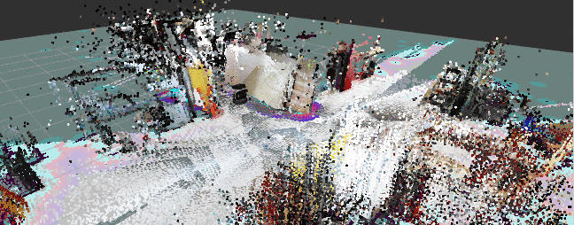
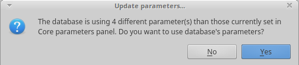
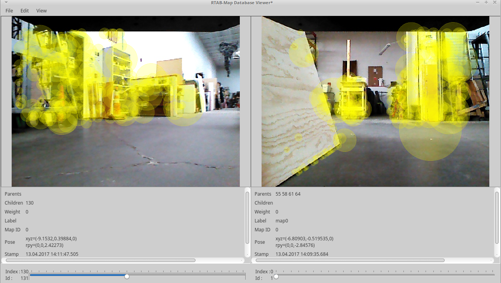
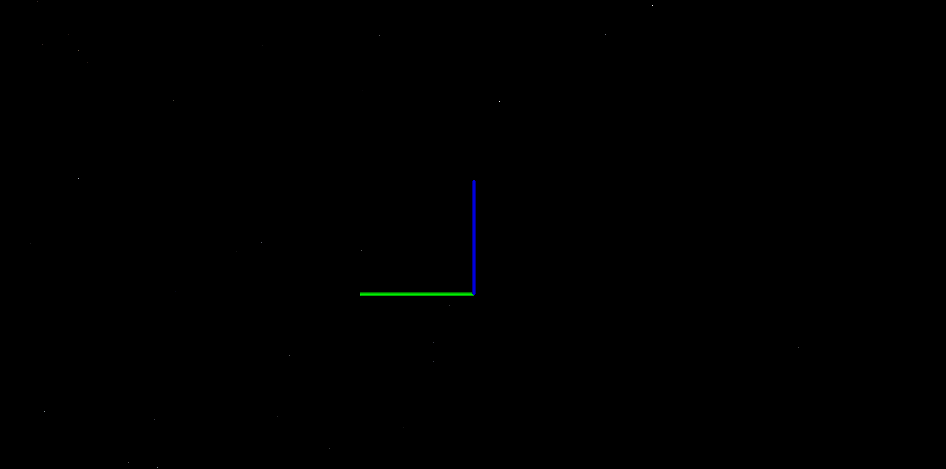

## RTABMAP
RTABMAP (Real-Time Appearance-Based Mapping) is a RGB-D Graph-Based SLAM approach based on an incremental appearance-based global Bayesian loop closure detector.

RTABMAP combines gmapping with 3D SLAM in order to do autonomous navigation (in the next tutorials) while 3D mapping.
Along with 3D point cloud data from the depth sensor, RTABMAP also collects 2D and 3D laser scan data.

## Installation
These instalation steps are to be done on BOTH the Turtlebot and Master computers.

1. Connect to a Wi-Fi network that has internet access
2. Open a new terminal
    1. `sudo apt-get install ros-kinetic-rtabmap-ros -y`
3. Connect back to your Turtlebot Wi-Fi network.

## Starting RTABMAP on the Turtlebot
In order to start and configure RTABMAP properly, we need to create our own launch file on the Turtlebot.

1. Create a workspace folder on the Turtlebot computer:
    1. On the Turtlebot Computer, open a new terminal
        * `mkdir ~/workspace`
        * `cd ~/workspace`

2. Create a new launch file to start RTABMAP on the Turtlebot with default configurations:
    1. On the Turtlebot computer, open a new terminal
        * `cd ~/workspace`
        * save [rtabmap.launch](scripts/rtabmap.launch) to workspace
 

3. On Turtlebot, start minimal.launch
    1. `roslaunch turtlebot_bringup minimal.launch`

4. On Turtlebot, start the rtabmap.launch 
    1. `cd ~/workspace`
    2. `roslaunch rtabmap.launch database_path:=~/workspace/rtabmap.db`
        * the rtabmap.launch automatically launches 3dsensor.launch
        * the argument `database_path:=` is the location of the database file
            * if no database exists, rtabmap will create a new one

## Visualizing RTABMAP data

1. On the master computer, start RVIZ
    1. `roslaunch rtabmap_ros demo_turtlebot_rviz.launch`

2. On the master computer, start keyboard teleop
    1. `roslaunch turtlebot_teleop keyboard_teleop.launch`

3. Drive the Turtlebot around your map using the keyboard_teleop, and visualize the collected data in RVIZ.
    * In order to collect data fully, you will need to stop the turtlebot periodically and slowly turn the turtlebot in circles  
    

    * You can bring up an image view in RVIZ by adding a new display:  
      * Under "Displays" click the "Add" button
      * Click the "By Topic" tab
      * Select the drop-down for `/camera/rgb/image_raw`
      * Click on "Image"
      * Click "Ok"
    

    * While you drive the Turtlebot around, it will begin to generate a map  
    
      * The white in the map is known empty space
      * The dark borders around the white are known obstacles such as walls and other objects
      * The grey tiles surrounding the map is unknown space
      * The 3d points that are verified using closed-loop detection will be shown in RVIZ
      

## Viewing the RTABMAP data
RTABMAP provides their own tool to visualize and manipulate data.  
With the `rtabmap-databaseViewer` tool, you can:
  - Open rtabmap databases
  - View rtabmap 2d and 3d data
  - Detect more loop closures
  - Refine detected loop closures
  - Generate a 3D map file (.ply, .pcd)
  - Generate 2D-3D laser scans (.ply, .pcd)

1. Copy the database from the Turtlebot to the Master Computer
    1. On the Master Computer, open a new terminal:
        * `cd ~/workspace`
        * `scp turtlebot@IP_OF_TURTLEBOT:~/workspace/rtabmap.db .`
          * The remote copy operation may take some time depending on the database size

2. Use `rtabmap-databaseViewer` to view the rtabmap data
    1. On the master computer, in a terminal:
        * `cd ~/workspace`
        * `rtabmap-databaseViewer rtabmap.db
    2. If a prompt comes up to Update Parameters
        * Press "Yes"  
        
    3. The default display in the database viewer shows the loop closure detection  
    
    4. To view the 3D map:
        * Press "Edit" on the top bar
        * Press "View 3D Map"
        * Select "4" and hit "OK"
        * Type "8.0" and hit "OK"
        * Scroll out and move around the 3D point coud map  
        

## Tuning RTABMAP Parameters
Coming soon, we are working out the best parameters to use with this Turtlebot setup

 

[Return to the main README page](/README.md)
