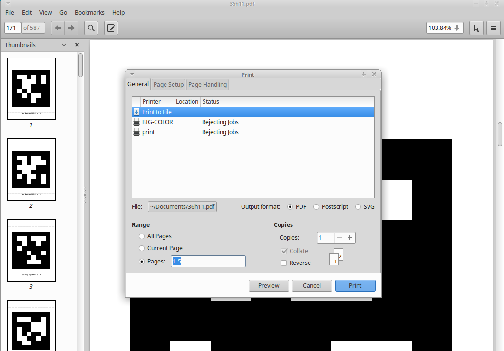
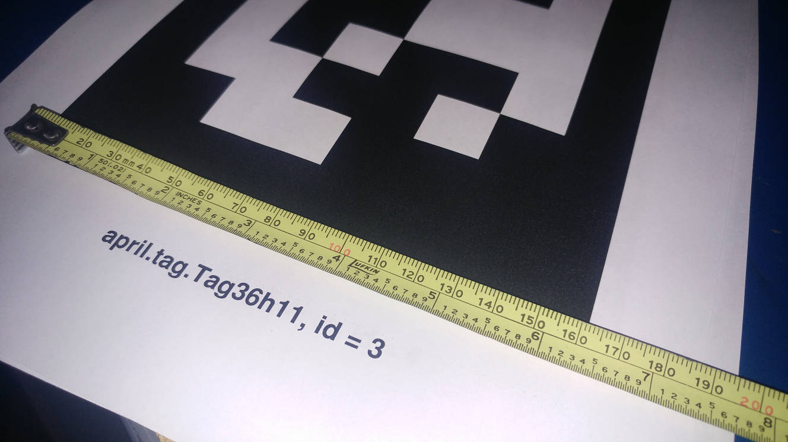

## Fiducial Markers
Fiducial markers can function as identifiers for robots, rooms, and objects, as well as serve tasks in augmented reality and 3d mapping.  
AprilTags are a visual fiducial system that takes tags created from an ordinary printer. The AprilTag software can compute the 3D position, orientation, and identity of tags relative to the camera's viewpoint.

## Prequisites
This section **requires** the *catkin_ws* to be initialized and the *turtlebot_dabit* package created.  
[Please click here to learn how to initialize the catkin workspace](08-Catkin_Workspace.md)

## Installation
Installation should be done on *both* **master** and **turtlebot** computers
1. Install the OpenCV and GCAL libraries
    1. `sudo apt install libopencv* libcgal-dev libcgal-qt5*`
2. Download, the apriltags-cpp opencv library
    1. `cd ~/workspace`
    2. `git clone -b kinetic-devel https://github.com/dabit-industries/apriltags_cpp`
    3. `mkdir apriltags_cpp/build`
    4. `cd apriltags_cpp/build`
    5. `cmake ..`
    6. `make`
    7. `sudo make install`
3. Download the apriltags library
    1. `git clone -b kinetic-devel https://github.com/dabit-industries/apriltags`
4. Build the apriltags packasge
    1. `cd ~/catkin_ws`
    2. `catkin_make`

## Print some AprilTags
To generate and print AprilTags, you can convert the postscript to a pdf, or you can use a postscript viewer such as `gv`.  
For this tutorial, we will convert the postscript file to a pdf for printing.  
The *page number* in the .pdf corresponds to the *tag ID* (eg. *page 1* is *tag ID 1*)
1. Convert the postscript file `36h11.ps` into a pdf  
   This will create a 587-page long PDF with 587 different apriltags.
    1. `cd ~/catkin_ws/src/apriltags/tags/`
    2. `ps2pdf 36h11.ps 36h11.pdf`
2. Open the generated pdf, and print the first 5 pages
    1. `evince ~/catkin_ws/src/apriltags/tags/36h11.pdf`
    2. Go to **File**>*print*
        1. Under *Range* click *pages* and type `1-5`  
        

## Measure the AprilTags
**!!** This step is not neccesary if you are printing on standard letter paper with the steps above.  
With the steps above, the width measurement is `161mm`  
In order to have accurate tag localization, you need to get the width of the tag in *millimeters*:
1. Take one of the tags, and lay it on a flat surface
2. With a ruler or tape measure, measure the width of the tag box  
  

## Create a launch file
1. Create a new launch file in your *turtlebot_dabit/launch* directory:
    1. `cd ~/catkin_ws/src/turtlebot_dabit/launch`
    2. `gedit fiducial.launch`  
```xml
<launch>
  <node pkg="apriltags" type="apriltags" name="fiducial_markers" output="screen">
    <param name="~default_tag_size" value="0.160" />

    <param name="~viewer" value="false" />
    <param name="~publish_detections_image" value="true" />

    <param name="~display_type" value="CUBE" />
    <param name="~marker_thickness" value="0.02" />


    <remap from="~image" to="/camera/rgb/image_raw"/>
    <remap from="~camera_info" to="/camera/rgb/camera_info"/>
    <remap from="~marker_array" to="/apriltags/marker_array"/>
    <remap from="~detections" to="/apriltags/detections"/>
  </node>
</launch>
```

## Running the fiducial marker launch
1. On the **turtlebot** laptop, open a new terminal:
    1. `source ~/catkin_ws/devel/setup.sh`
    2. `roslaunch turtlebot_dabit fiducial.launch`

## View the apriltag detections
You can view the apriltag detection window on either the **turtlebot** or **master** laptop.  
1. Open a new terminal:
    1. `source ~/catkin_ws/devel/setup.sh`
    2. `rosrun rqt_image_view rqt_image_view image:=/apriltags/detections_image`

## Get tag ID and position of markers
On either the **turtlebot** or **master** laptop:
1. Open a new terminal:
    1. `source ~/catkin_ws/devel/setup.sh`
    2. `rostopic echo /apriltags/detections`

## Troubleshooting
Sometimes `catkin_make` fails. You have to run `catkin_make` again after it fails.  

If you get an error message about ROS MESSAGES, source the catkin_workspace setup: `source ~/catkin_ws/devel/setup.sh`
 

[Return to the main README page](/README.md)
