## Quanergy M8
The M8 is the first cost-effective long range LiDAR sensor enabling ubiquitous use of smart sensing in dynamic situations— made and tested for 3D mapping, security, harsh industrial environments and the most demanding applications. The M8 sensor’s small design sees by day or night, with no IR signature needed, and works in any weather. Multiple laser beams and Time-of-Flight (TOF) depth perception result in 3D point clouds for spatial sensing. With a 360° field of view, 420,000 points per second, long measurement range, high accuracy, and fine resolution, this sensor is now available at a breakthrough price.

## Prequisites
This section **requires** the *catkin_ws* to be initialized and the *turtlebot_dabit* package created.  
[Please click here to learn how to initialize the catkin workspace](08-Catkin_Workspace.md)  

You will also need access to Quanergy's software: `quanergy_client` and `quanergy_client_ros`

## Included in Quanergy M8 Dev Kit
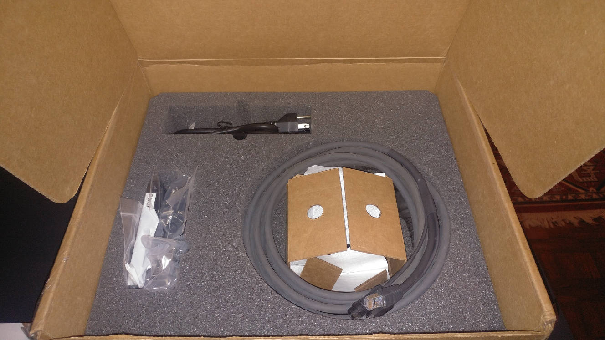  
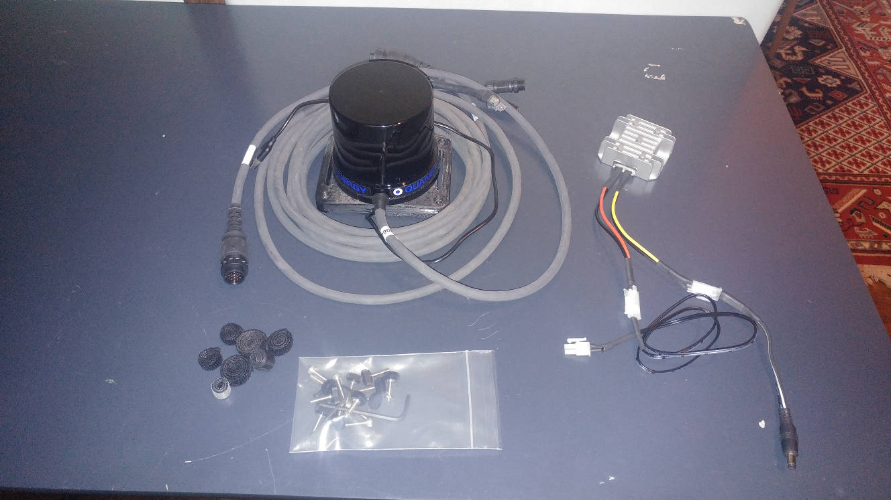  
Included in your kit:  
- Quanergy M8 LiDAR  
- 3d printed mount for Quanergy M8 (assembled)  
- Quanergy M8 tether cable  
- 12v to 24v Boost Converter (Power Adapter)  
- Razor 9DOF IMU (embedded in M8 mount)  
- Miscellaneous Velcro  
- Miscellaneous fasteners  

## Assembly
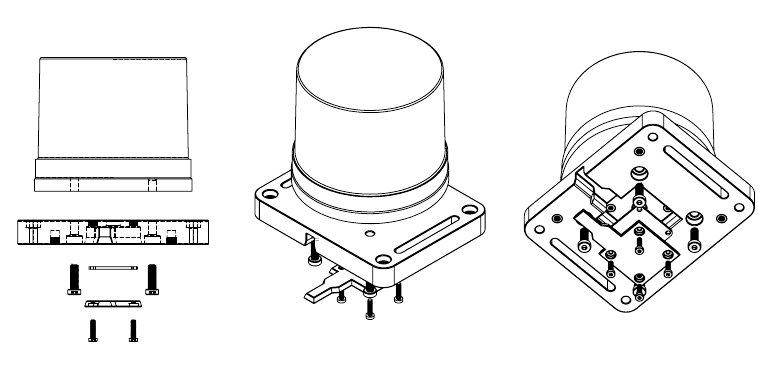  

## Mounting on Turtlebot
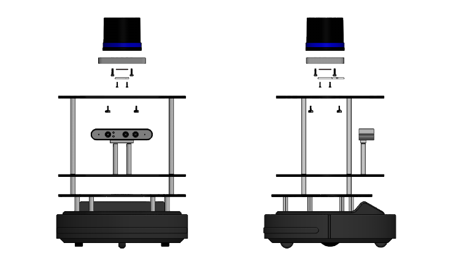  

1. Mount the lidar on top of the Turtlebot:
    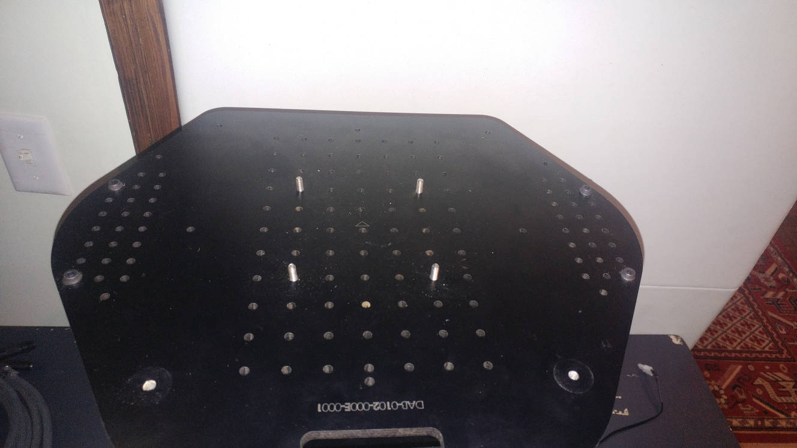  
2. Install the boost converter (power adatper)  
    - The Red/Black cable pair is 12vDC (from Kobuki)
    - The Yellow/Black cable pair is 24vDC (to Lidar)
    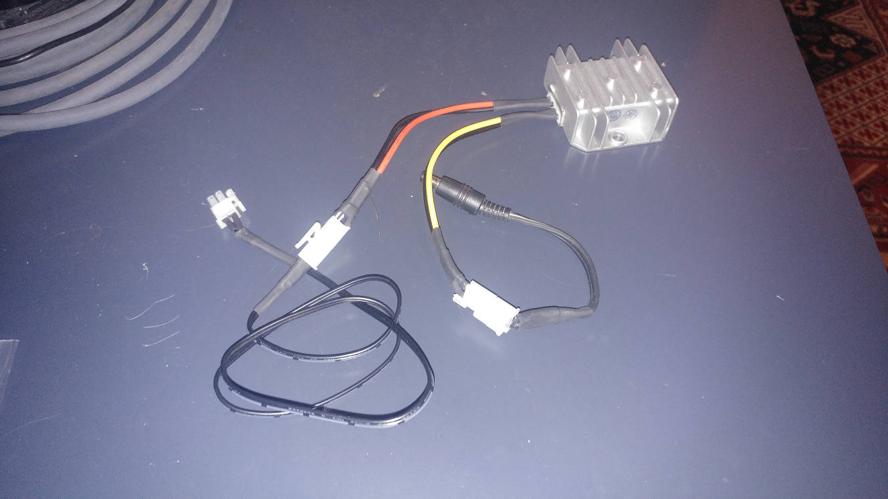	 
    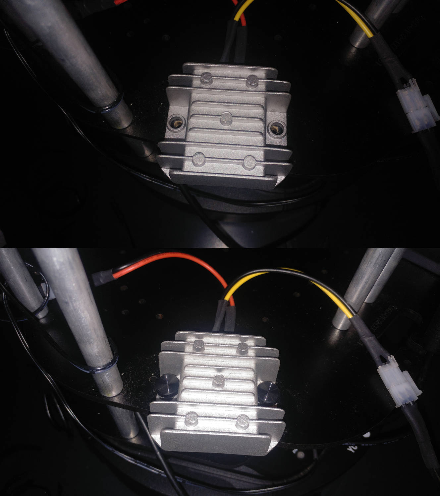	
3. Hook up and attach the M8 tether cable  
    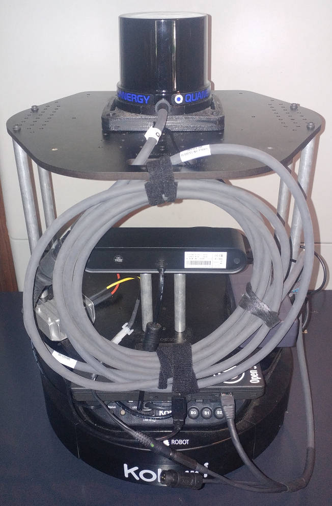  
4. Plug in IMU
    1. The IMU plugs in to a USB port in your laptop or on a USB hub.  
5. Plug in power to Kobuki
    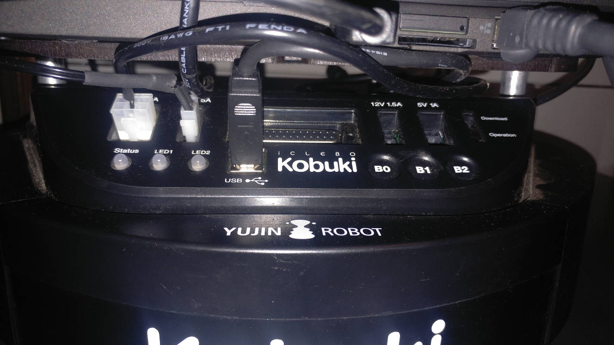  
    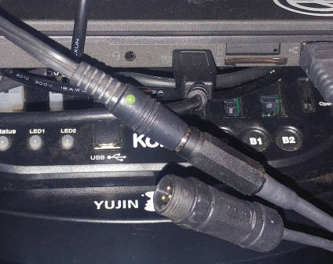  
6. Turn on your Kobuki and check for power in the power cable and in the lidar:    
    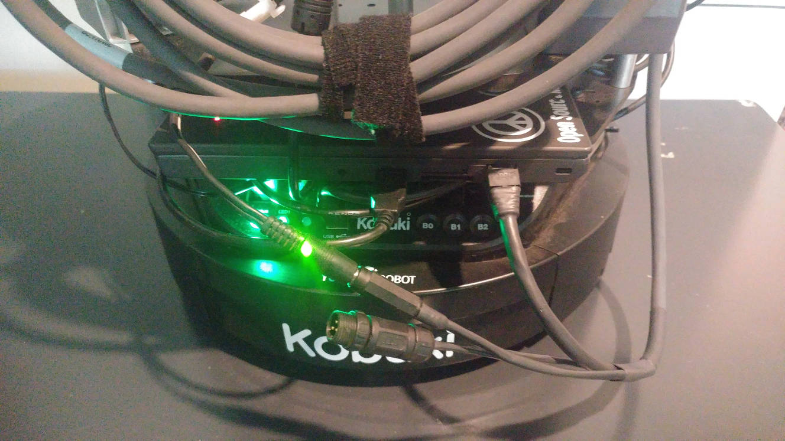  
    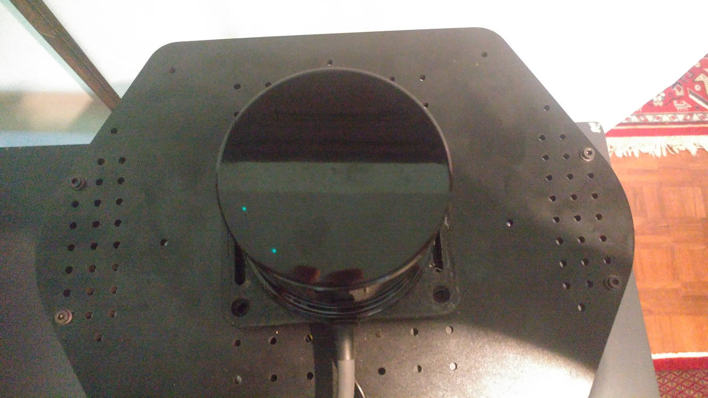  
    - The lights from the Lidar turn off after a short time  
7. Turn off your Kobuki
8. Plug the ethernet cable from the M8 tether into laptop  

## Installation
### Network Configuration
1. Open Network Preferences
    - In the top right of your screen, click on the Wifi icon:
      
    - Click on "Edit Connections"  
2. Click on the "Add" button:  
    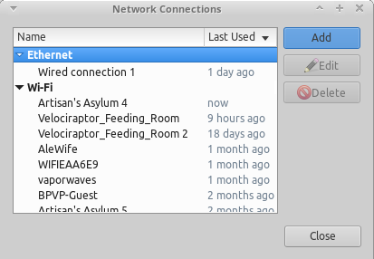
3. Click on "Ethernet" and click "Create"  
      
4. Click on "Device" and click on the first available device:  
    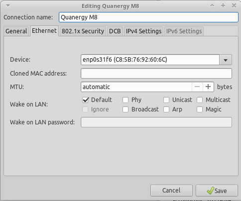  
    - Change the "Connection Name" to "Quanergy M8"  
5. Click on the tab "IPv4 Settings"  
    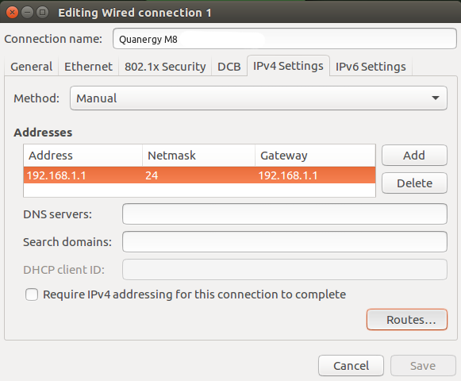  
    - Add the addresses listed in the picture  
6. Click on "Routes" in the bottom right  
    - Tick "Use this connection only for resources on its network"  
    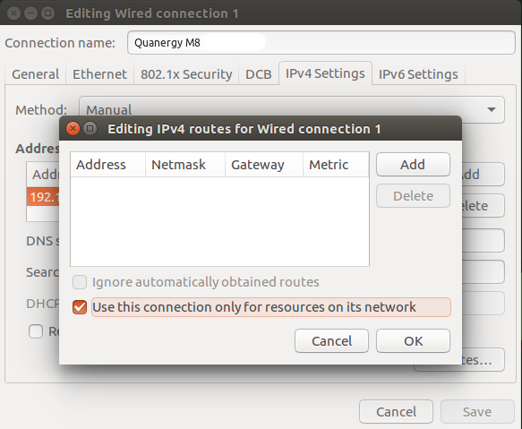  
7. Click on your new network in the Wireless Menu drop-down box  
      
### Install the Quangery libraries
**This step is handled in the automated setup**  
1. `cp -r ~/turtlebot_dabit/Setup/workspace/quanergy_client ~/workspace`  
2. `cd ~/workspace/quanergy_client`  
3. `mkdir build`  
4. `cd build`  
5. `cmake ..`  
6. `sudo make install`  

### Install the Quanergy catkin package
**This step is handled in the automated setup**
1. `cp -r ~/turtlebot_dabit/Setup/catkin_ws/src/quanergy_client_ros ~/catkin_ws/src`
2. `cd ~/catkin_ws`
3. `catkin_make`

## Launch
Launching the driver only:  
- `roslaunch turtlebot_dabit quanergy.launch`  

Launching the laser_scan converter:  
- `roslaunch turtlebot_dabit quanergy_lidarscan.launch  

Launching the driver with visualization:  
- `roslaunch turtlebot_dabit quanergy_test.launch`  

## Visualization
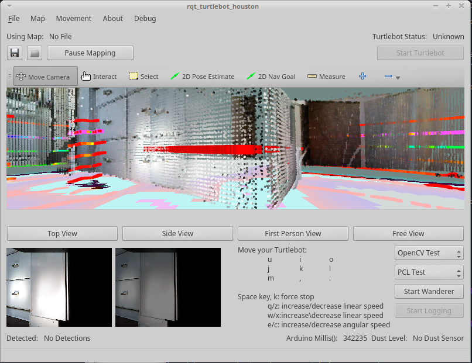  
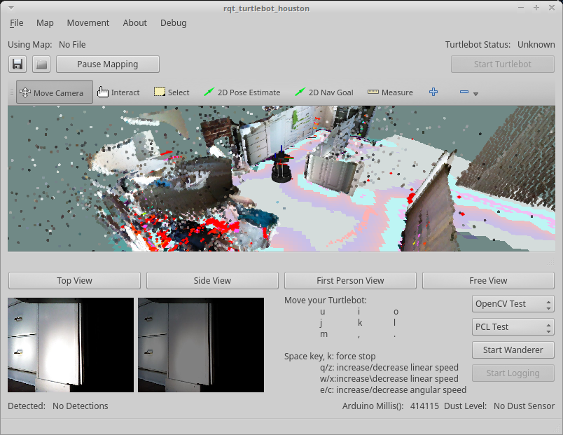  
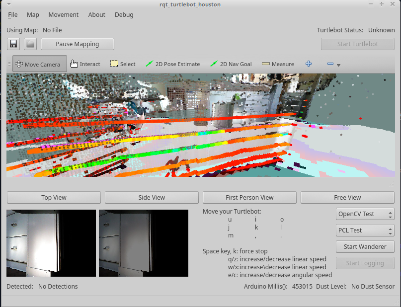  

## Troubleshooting

[Return to the main README page](/README.md)
