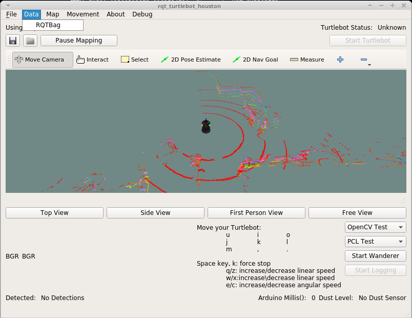
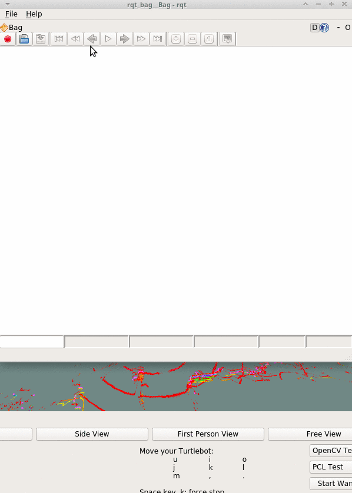
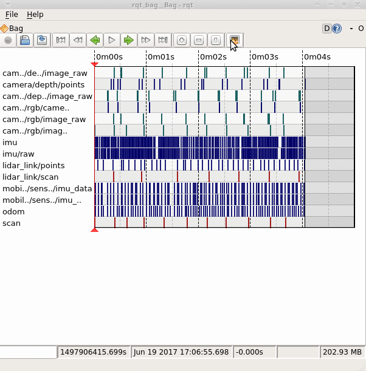
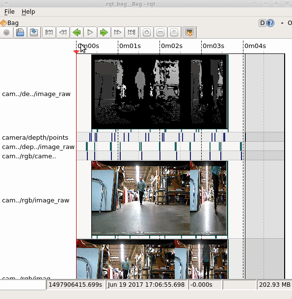

## RQT_TURTLEBOT_DABIT_BAG
RQT_TURTLEBOT_DABIT_BAG is a configuration of our software to load, play, and visualize ROSBAG data.  

## Prequisites
1. [Automated Setup](00b-Automated_Setup.md)  
2. [rosbag](22-rosbag.md)  
3. [rqt_bag](22a-rqt_bag.md)  

## Operation
1. Collect your bag data using the GUI tool  
    1.   
    2.   
        - When you hit the record button again it will stop recording
        - Your bag is saved
2. Close the rqt_bag gui AND rqt_turtlebot_dabit gui
3. Launch *master_bag* on the desktop
4. In the rqt bag gui, load the bag file:
    1. 
5. Enable image previews in rqt_bag:
    1. 
6. Enable topic publishing in rqt_bag:
    1. 
7. Play the bag and visualize the data!
    1. 

[Return to the main README page](/README.md)
